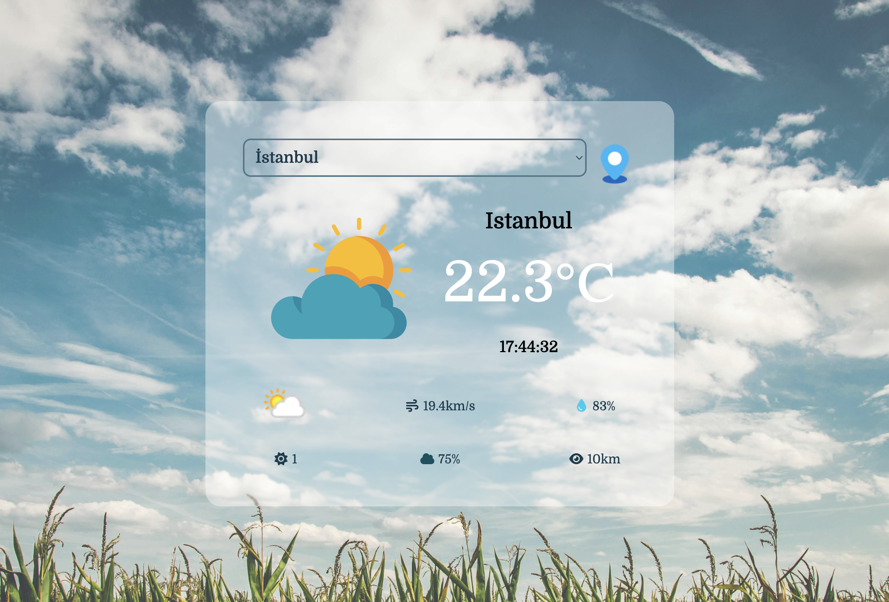
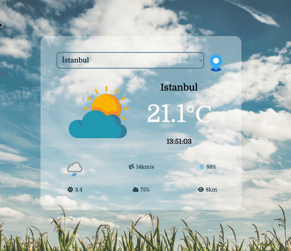

# 🌦️ Weather App

Weather App, kullanıcıların Türkiye’deki şehirlerin anlık hava durumunu görüntüleyebildiği, huzurlu ve minimalist bir tasarıma sahip web uygulamasıdır.
Uygulama, sıcaklık, rüzgar hızı, nem, bulutluluk, UV indeksi ve görüş mesafesi gibi bilgileri gerçek zamanlı olarak sunar. Arka planında yeşil ve doğa temalı bir görsel kullanılarak kullanıcıya sakin ve rahat bir deneyim sunulması hedeflenmiştir.

## 🚀 Özellikler

* Türkiye’deki tüm şehirler için anlık hava durumu

* Sıcaklık, rüzgar hızı, nem, bulutluluk, UV indeksi ve görüş mesafesi bilgisi

* Dinamik olarak güncellenen saat

* Huzurlu ve minimalist tasarım

* Responsive tasarım: mobil ve masaüstü uyumlu

###  🖼️ Ekran Görüntüsü

### 🔗 Canlı Demo
(https://rahile0120.github.io/WeatherApp/)

### 🎞️ Demo (GIF)

### ⚙️ Kullanılan Teknolojiler

* HTML5 & CSS3 → Temel yapı ve tasarım

* JavaScript (Vue.js 3) → Dinamik veri yönetimi

* WeatherAPI
 → Anlık hava durumu verisi

* Türkiye API
 → Türkiye şehir listesi
